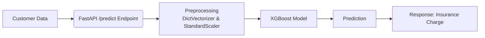

# Insurance Charge Prediction API

This project provides a FastAPI-based web service to predict health insurance charges using a trained XGBoost model.

## Problem Statement

The goal of this project is to predict the individual medical costs billed by health insurance based on a patient's demographic and personal attributes. This is a regression problem where the target variable, `charges`, is a continuous value.

## Dataset Description

The model is trained on the [Insurance Charges Dataset](https://www.kaggle.com/datasets/nalisha/health-insurance-charges-dataset/data?select=insurance.csv) from Kaggle.

**Features:**
- `age`: Age of the primary beneficiary.
- `sex`: Gender of the insurance contractor (male, female).
- `bmi`: Body mass index, providing an understanding of body weight.
- `children`: Number of children covered by health insurance.
- `smoker`: Smoking status of the beneficiary (yes, no).
- `regions`: southeast, southwest, northeast, northwest.

**Target:**
- `charges`: Individual medical costs billed by health insurance.

The `region` feature was initially considered but excluded from the final model after a Kruskal-Wallis test showed no statistically significant difference in charges across regions (p-value = 0.19). However, I decided to include this in the xgboost model.

## Exploratory Data Analysis (EDA) Summary

- The `charges` distribution is right-skewed. A log transformation (`charges_log`) was applied to normalize it.
- Smokers have significantly higher insurance charges compared to non-smokers.
- Charges generally increase with age and BMI.
- There is a wide variability in charges for individuals with no children.
- The `region` variable was found to be statistically insignificant and was excluded from the model.

## Modeling Approach & Metrics

### Approach
An XGBoost regressor was selected as the final model after a comparative evaluation with several other regression algorithms. The model was trained on the log-transformed target variable to improve performance.

### Preprocessing
- **Categorical Features:** Handled using `DictVectorizer` for one-hot encoding.
- **Numerical Features:** Scaled using `StandardScaler` to ensure they have a zero mean and unit variance.

### Model Comparison
The following models were evaluated on the validation set:

| Model            | Validation RMSE (log scale) | Validation R² |
|------------------|----------------------------|---------------|
| LinearRegression | 0.37                       | 0.82          |
| Ridge           | 0.37                       | 0.82          |
| Lasso           | 0.72                       | 0.33          |
| RandomForest     | 0.33                       | 0.86          |
| XGBoost         | **0.31**                   | **0.88**      |

The XGBoost model provided the best performance and was chosen for the final API.

### Metrics
- **Root Mean Squared Error (RMSE):** Used to measure the average magnitude of the errors.
- **R-squared (R²):** Used to measure the proportion of the variance in the dependent variable that is predictable from the independent variables.

## How to Run Locally and via Docker

### Prerequisites
- `uv` package manager installed.
- `Docker` and `docker-compose` installed (for Docker deployment).

### Local Setup
1. **Clone the repository and navigate to the project directory.**
2. **Set up the environment:**
   ```bash
   uv sync
   ```
3. **Train the model (optional, as a pre-trained model is included):**
   ```bash
   # Make sure you have the dataset and set the DATASET_PATH environment variable
   uv run python mid-term/train_xgb.py
   # Or download it from Kaggle - link provided above
   ```
4. **Run the FastAPI server:**
   ```bash
   uv run uvicorn mid-term.predict:app --reload --host 0.0.0.0 --port 9696
   ```
5. **Access the API:**
   - The API will be available at `http://localhost:9696`.
   - Interactive documentation is available at `http://localhost:9696/docs`.

### Docker Setup
1. **Build the Docker image from the project root:**
   ```bash
   docker build -t myproject -f mid-term/Dockerfile .
   ```
2. **Run the Docker container:**
   ```bash
   docker run -it -p 9696:9696 myproject
   ```
3. **Access the API:**
   - The API will be available at `http://localhost:9696`.
   - Interactive documentation is available at `http://localhost:9696/docs`.

## API Usage Example

You can make a `POST` request to the `/predict` endpoint to get a prediction.

**Using `curl`:**
```bash
curl -X POST "http://localhost:9696/predict" \
-H "Content-Type: application/json" \
-d '{
    "age": 31,
    "sex": "female",
    "bmi": 30.5,
    "children": 0,
    "smoker": "no",
    "region": "southeast"
}'
```

**Example Response:**
```json
{
  "prediction": 4006.93
}
```

## Architecture Diagram



## Known Limitations / Next Steps

### Limitations
- The model's performance is highly dependent on the quality and representativeness of the training data.
- The current handling of missing data is simplistic (dropping rows), which might not be optimal for all real-world scenarios.
- The model is trained on a static dataset and may not capture temporal trends or changes in healthcare costs.